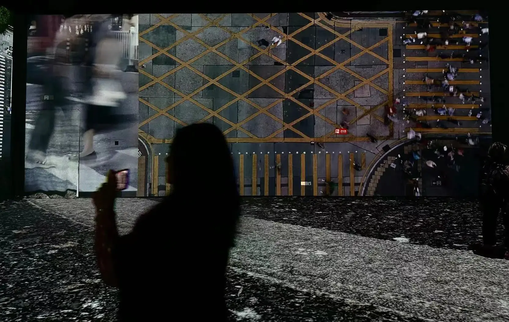

# Kyle的博客主页🫠

> 自由是做你喜歡做的事，幸福是喜歡你做的事。
> 
> Doing what you like is freedom. Liking what you do is happiness.
> 

---

我是哈尔滨工业大学深圳校区的学生。我想要通过博客记录一下自己的计算机学习历程，同时分享一些自己的思考。博客现在仍在建设中，今后将不断完善博客的内容。

---

I am a student from Harbin Institute of Technology (Shenzhen). I want to document my computer learning journey through the blog and share some of my own reflections at the same time. The blog is still under construction and will be improved in the future.

---

## 博客知识内容目前范围： The current scope of blog knowledge content:

- 算法 / Algorithm
- 时事思考 / Current Reflections
- 硬件 / Hardware
- 设备评测 / Device Reviews
- 数学分析 / Mathematical Analysis
- 高等代数 / Advanced Algebra
- 大学物理 / Physics
- 电路与电子学 / Circuits and Electronics
- ...
