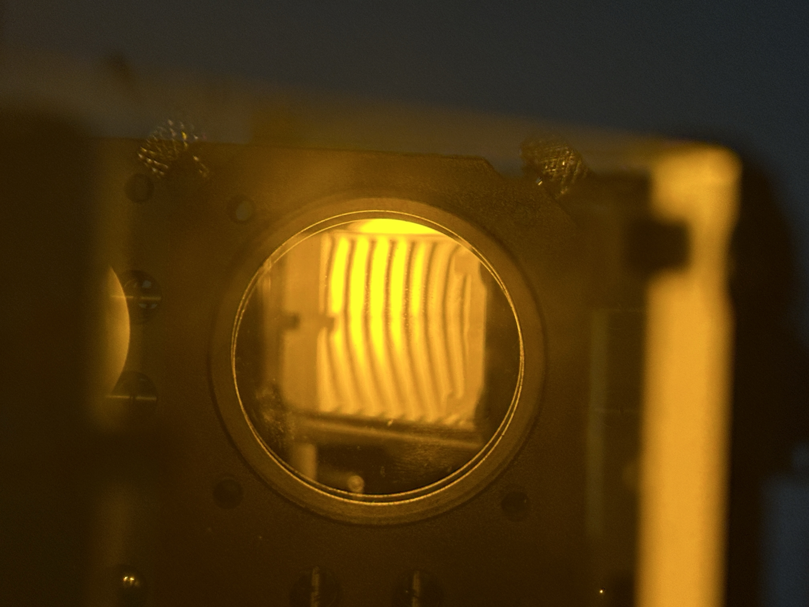

---

  <!-- 左侧图片 -->
  

    
  

  <!-- 右侧内容 -->
  

    <h2 class="text-xl font-bold mb-2" style="color: var(--text-color);transition: color 0.5s">大物实验绪论</h2>
    
帮助后人

  

---

  <!-- 左侧图片 -->
  

    
  

  <!-- 右侧内容 -->
  

    <h2 class="text-xl font-bold mb-2" style="color: var(--text-color);transition: color 0.5s">线代笔记1</h2>
    
最小二乘法

  

